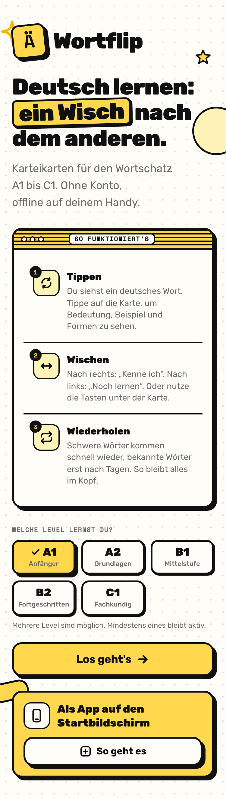
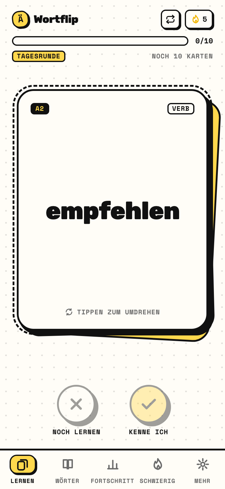
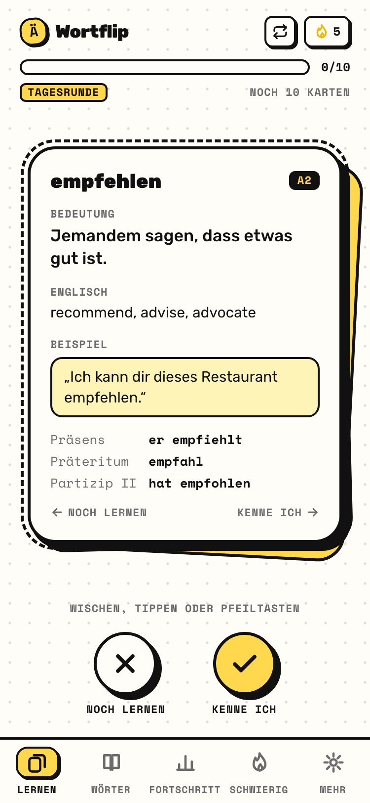
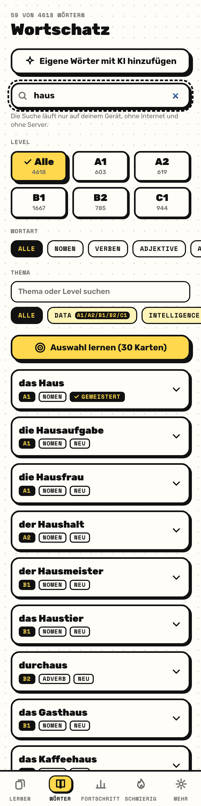
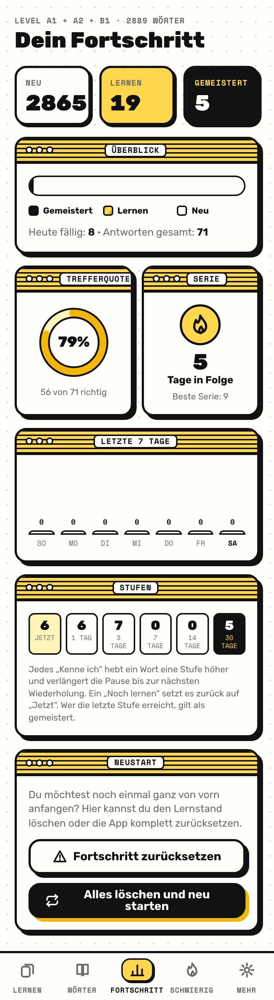
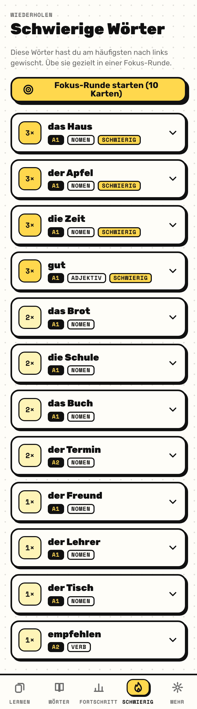
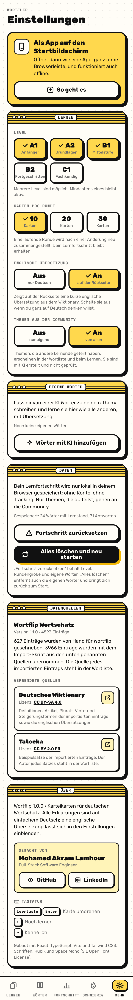
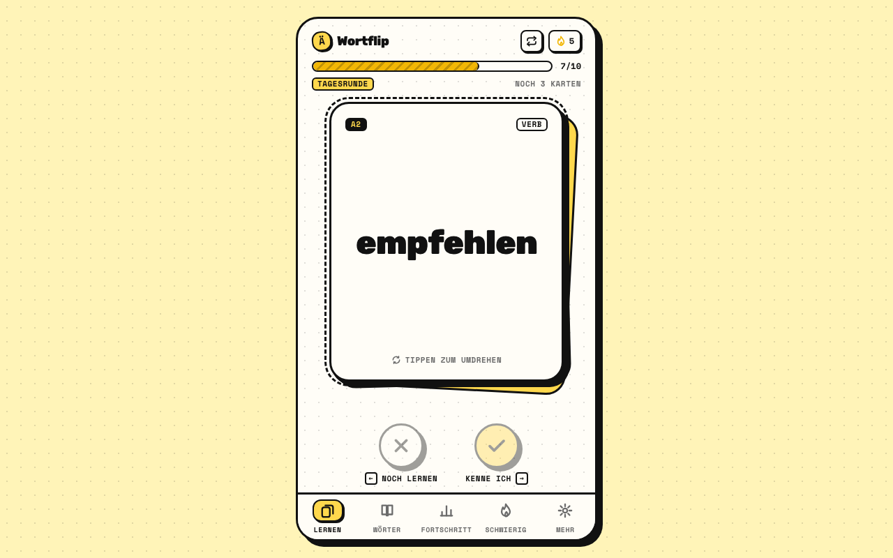

# Wortflip

Learn German vocabulary from A1 to C1 with swipeable flashcards. The interaction feels like a dating app; the purpose is memory.
A static Progressive Web App: no account, no server, no requests to any API while you use it.

**Live:** https://wortflip.de

**Made by** Mohamed Akram Lamhour: [GitHub](https://github.com/Lamhour-Mohamed-Akram) · [LinkedIn](https://www.linkedin.com/in/ak2lamhour/)

- **Tap** to flip the card: definition, example sentence and forms (plural, verb forms, comparison), all in simple German.
- **Swipe** to rate: right = "Kenne ich", left = "Noch lernen". Buttons and keyboard work too.
- **Spaced repetition** decides when a word comes back (Leitner boxes: 1, 3, 7, 14, 30 days). Daily rounds have 30 cards by default (10, 20 or 30 in Settings). A topic or a selection from the word list is learned in rounds of at most 30 cards; due and new words come first, so the next round continues where the last one stopped. The word list itself always shows every word of a topic (a topic holds up to 100).
- **4593 words** in five levels: 627 hand-written (A1 193, A2 147, B1 144, B2 71, C1 72) plus 3966 imported from Wiktionary and Tatoeba. The A1 to B1 imports were selected with the Goethe-Institut word lists (A1 409, A2 472, B1 1499); the B2 and C1 imports (714 and 872) were selected by word frequency, so those two levels are approximate. Levels can be combined freely.
- **English translation**: the back of every card shows a short translation from the German Wiktionary (every word has one; about 50 come from a small hand-written list). It can be switched off in Settings for learners who want to stay fully in German.
- **Own words from any AI**: pick a level and a topic ("Beim Arzt"), copy the generated prompt into ChatGPT, Claude, Gemini or any other assistant, paste the JSON answer back, and the words become normal cards with translation and topic chip. They are stored on the device, can be exported and imported as a file, and the same file can be added to the repository for everyone with `node scripts/import-custom.mjs`.
- **Community topics**: a new topic is shared automatically (a retry button appears when the device was offline). It lands in a free Supabase table and every other learner sees it in their word list within minutes, cached for offline use. The same topic name and level is one community topic: new words are merged into it and the sharer receives the words it lacked. Offensive words are refused in the app and in the database; shared topics are marked as AI-generated and unchecked; three reports from different devices hide a topic, and the whole community part can be switched off in Settings.
- **Word list with search**: filter by level and word type, search even without umlauts ("gefuhl" finds "Gefühl"), and learn the current selection. Search runs entirely in the browser over the bundled data; nothing is looked up online and nothing counts against hosting limits.
- **Offline and installable**: app shell, vocabulary and fonts are cached by a service worker.
- **Add to home screen**: an install card triggers the native install prompt where the browser supports it (Android, Chrome and Edge on desktop) and shows step-by-step instructions on iPhone and iPad, matched to the browser in use (Safari, Chrome, Edge, Firefox).
- **Everything local**: progress, streak and statistics live only in `localStorage`. The only thing that ever leaves the device is a topic the learner shares with the community.

## Screenshots

<table>
  <tr>
    <td align="center"><br><sub>Onboarding</sub></td>
    <td align="center"><br><sub>Learn: card front</sub></td>
    <td align="center"><br><sub>Learn: card back</sub></td>
    <td align="center"><br><sub>Words: search and filters</sub></td>
  </tr>
  <tr>
    <td align="center"><br><sub>Progress</sub></td>
    <td align="center"><br><sub>Difficult words</sub></td>
    <td align="center"><br><sub>Settings</sub></td>
    <td align="center"><br><sub>Desktop frame</sub></td>
  </tr>
</table>

## Local development

Requires Node.js 20 or newer.

```bash
npm install        # install dependencies
npm run dev        # dev server with hot reload (http://localhost:5173)
npm run build      # type check + production build into dist/
npm run preview    # serve the production build locally (http://localhost:4173, with service worker)
npm test           # unit tests: scheduler, session logic, storage, dataset, importer parser
npm run typecheck  # TypeScript only
npm run icons      # regenerate the PWA icons and favicon.svg (no dependencies)
npm run import     # vocabulary importer, see below
```

The service worker is only active in the production build (`npm run build && npm run preview`).

## Deployment

The build is a plain static site (`dist/`). There are no server routes; navigation uses the URL hash.

| Platform             | Settings                                                                                                              |
| -------------------- | --------------------------------------------------------------------------------------------------------------------- |
| **Netlify**          | `netlify.toml` is included (build `npm run build`, publish `dist`). Link the repository and every push deploys.        |
| **Cloudflare Pages** | Build command `npm run build`, output directory `dist`, Node 20 or newer.                                              |
| **GitHub Pages**     | Possible with `BASE_PATH=/Wortflip/ npm run build` and your own Actions workflow; the live version runs on Netlify at wortflip.de.    |

**Sub-path hosting** (for example `https://name.github.io/Wortflip/`): set the base path at build time:

```bash
BASE_PATH=/Wortflip/ npm run build
```

Manifest, service worker, icons and fonts are then served relative to that path.

### PWA and new versions

`vite-plugin-pwa` generates `manifest.webmanifest` and `sw.js` (Workbox, `generateSW`). All assets (`js`, `css`, `html`, `svg`, `png`, `woff2`) are precached, so the app works fully offline after the first visit. The vocabulary is bundled as its own chunk (`vocabulary-*.js`), so a code update does not re-download the data and a data update does not re-download the code.

New versions use `registerType: 'prompt'`: the new service worker is installed in the background but only activated when the user taps **Aktualisieren** (`src/pwa/ReloadPrompt.tsx`), so a running learning session is never interrupted by a surprise reload. Old caches are cleaned up on activation (`cleanupOutdatedCaches`).

The stored state carries a `version`. On load every part is validated (`src/learning/storage.ts`): invalid or corrupted pieces are replaced by defaults one by one instead of crashing the app. Future schema changes get a migration there.

## Project structure

```
├── index.html                     entry point, meta tags, manifest link
├── vite.config.ts                 Vite, Tailwind, PWA (manifest + Workbox), Vitest
├── netlify.toml                   Netlify build settings
├── scripts/generate-icons.mjs     builds public/icons/*.png and favicon.svg without dependencies
├── scripts/import-vocabulary.mjs  importer for Wiktionary + Tatoeba (parser in scripts/import/, with tests)
├── docs/screenshots/              the images used in this README
├── public/                        icons, favicon.svg
└── src/
    ├── data/                      data layer (independent of the UI)
    │   ├── types.ts               VocabularyItem, VocabularyDataset, VocabularySource
    │   ├── vocabulary/            a1.ts, a2.ts, b1.ts (hand-written), imported.json (generated) + imported.ts (typed wrapper)
    │   └── index.ts               dataset, helpers (headword, pluralForm, itemsForLevels, validateDataset)
    ├── learning/                  learning logic, pure functions without React
    │   ├── scheduler.ts           spaced repetition (boxes, intervals, "mastered")
    │   ├── session.ts             round building, queue, re-queueing after a left swipe
    │   ├── streak.ts              daily streak
    │   ├── stats.ts               accuracy, reviews per day
    │   ├── storage.ts             localStorage access with validation and defaults
    │   ├── time.ts                calendar-day helpers (DST safe)
    │   └── *.test.ts              unit tests (Vitest)
    ├── state/                     app state: reducer + React context, saved on every change
    ├── hooks/                     useTab (hash routing), useReducedMotion
    ├── components/                reusable UI: Button, Chip, Window, StatTile, ProgressBar,
    │                              Flashcard (front/back), SwipeableCard (gestures + flip),
    │                              ActionButtons, BottomNav, ConfirmDialog, LevelPicker, ResetButton, WordRow, ...
    ├── screens/                   Onboarding, Learn, Words (list + search), Progress, Difficult, Settings
    ├── pwa/ReloadPrompt.tsx       new-version and offline-ready notices
    ├── lib/                       cn(), formatting and search helpers
    ├── assets/fonts/              Rubik + Space Mono (SIL OFL), bundled locally
    └── index.css                  Tailwind theme (design tokens), flip animation, patterns
```

The separation is deliberate: `src/data` and `src/learning` import nothing from `src/components` or `src/screens`. Screens read state through `useApp()` and dispatch actions; the rules live in the reducer and in `src/learning`.

## Spaced repetition

Every word has a learning record (`WordProgress`) with a **box**, a due date (`dueAt`) and counters.

| Event                                     | Effect                                                                                              |
| ----------------------------------------- | --------------------------------------------------------------------------------------------------- |
| Word never seen                           | Status `new`, no stored record.                                                                     |
| "Kenne ich" in box *n*                    | Box *n + 1*; due after 1, 3, 7, 14 or 30 days. Status `learning`.                                   |
| "Kenne ich" in the last box               | Status `mastered`; the word keeps coming back every 30 days.                                        |
| "Noch lernen"                             | Back to box 0, due immediately, `incorrect + 1`, the word's streak resets. Status `learning`.        |
| "Kenne ich" before the word is due        | Counts as a correct answer but does **not** change box or due date (extra round).                   |

Inside a round:

- A round consists of due words (first) and new words (shuffled), limited by the round size (10, 20 or 30).
- Due words are sorted by difficulty and how overdue they are. From **3** "Noch lernen" answers on, a word counts as **difficult**.
- A word swiped left is re-queued **5 cards later**, a difficult word after **3** cards. While other cards remain, the same word never appears twice in a row.
- The round ends when every card has been answered with "Kenne ich" once.
- If nothing is due and nothing is new, the app offers an **extra round** with the words that become due soonest. The Difficult screen starts a **focus round** with the most-missed words, and the Words screen starts a round from any filtered selection.

The **streak** counts calendar days with at least one answer; a skipped day resets it to 0 (the best streak is kept).

## Restart and reset

- **Runde neu starten** (icon at the top right of the Learn screen): the current round is discarded and rebuilt. Answers already given stay saved.
- **Fortschritt zurücksetzen** (Settings and Progress screens): learning records, streak and statistics are deleted. Level and round size stay.
- **Alles löschen und neu starten** (Settings and Progress screens): everything is deleted and the app starts again at the onboarding.

Each of these asks for confirmation first.

## Vocabulary

The vocabulary lives in `src/data/vocabulary/` as typed arrays, one file per level, plus the generated `imported.json`. The UI only knows `dataset` from `src/data/index.ts`.

```ts
type VocabularyItem = {
  id: string;                      // stable: progress is stored under this id
  word: string;                    // "Tisch", "gehen", "sich erinnern"
  article?: 'der' | 'die' | 'das'; // nouns only
  plural?: string;                 // without article; omitted for singular-only nouns
  type: 'noun' | 'verb' | 'adjective' | 'adverb' | 'preposition' | 'conjunction' | 'other';
  level: 'A1' | 'A2' | 'B1';
  definitionDe: string;
  exampleDe: string;
  verbForms?: { thirdPersonPresent?: string; preterite?: string; participleII?: string };
  adjectiveForms?: { comparative?: string; superlative?: string };
  sourceIds?: string[];            // refers to dataset.sources[].id
  definitionUrl?: string;          // where definition and forms come from
  exampleSource?: { sourceId: string; author?: string; url?: string };
};
```

**Attribution:** `dataset.origin` and `dataset.sources` are shown in the Settings screen under "Datenquellen", and every imported card names its sources on the back. `validateDataset()` checks for duplicates, missing articles and unknown sources (`npm test`).

### Importing from Wiktionary and Tatoeba

`npm run import` fetches words from two free sources and writes them to `src/data/vocabulary/imported.json` (`imported.ts` next to it is only a typed wrapper):

- **German Wiktionary** (MediaWiki API): article, plural, verb forms, comparative and superlative, and the first definition. License CC BY-SA 4.0.
- **Tatoeba** (API): one short example sentence per word with its author. License CC BY 2.0 FR; the author is named in the word list entry (the learning card itself stays free of credits).

```bash
npm run import -- --list scripts/import/wordlist-test.txt        # your own list: one word per line, optional level
npm run import -- --frequency 2000 --a1 500 --a2 1200             # the 2000 most frequent words, levels by frequency
npm run import -- --frequency 12000 --min-rank 3000 --b1 3000 --b2 5500 --strict --merge --limit 1600   # B2 and C1 by frequency
npm run import -- --list list.txt --merge --override-level       # add to the existing import, levels from the list win
npm run import -- --frequency 300 --no-sentences --dry-run        # show only, write nothing
IMPORT_CONTACT="you@example.com" npm run import -- --list ...    # contact for the User-Agent (Wikimedia asks for it)
npm run import:translations                                       # English translations for every word (hand-written and imported)
```

`npm run import:translations` reads the English words from the translation tables of the same Wiktionary pages (first sense, at most three words) and writes them to `src/data/vocabulary/translations.json`, keyed by word id. It reuses the cached pages and only fetches the hand-written words; `scripts/import/translations-manual.json` holds hand-written fallbacks for the few pages without an English table. Run it again after adding words to a level file.

The script runs only on your machine, never in the app and never in the Netlify build. It requests slowly (Tatoeba: one request per second; Wiktionary: 30 pages every three seconds), waits as long as the server demands on a 429 answer, caches every response in `scripts/.cache/` (further runs are almost free) and skips words that already exist in the hand-written files. A run with 3000 words takes about 35 minutes.

**Word lists with official levels:** the Goethe-Institut word lists (A1, A2, B1) are a good source for which words belong to which level. `scripts/import/goethe-to-wordlist.mjs` turns such lists (CSV or TSV whose first column is the headword) into an import list where every word appears once with its lowest level. Only the headwords are used; example sentences, translations and audio from those lists are copyrighted and are never copied. The lists themselves do not belong in the repository (they live in `scripts/.cache/`).

```bash
node scripts/import/goethe-to-wordlist.mjs --out scripts/.cache/goethe.txt --in a1/*.tsv A1 --in a2/*.tsv A2 --in b1.csv B1
npm run import -- --list scripts/.cache/goethe.txt --lemma-only --merge --override-level
```

What the import can and cannot do:

- Forms are reliable, example sentences are mostly short and natural.
- Wiktionary definitions are written for adults, not in simple learner German, and the first sense is not always the everyday one (for "Bahn" the physics meaning comes before the railway). To improve an imported card, write the word into one of the level files; the next import skips it.
- The shipped import (3966 entries) combines two runs. First the Goethe lists as the selection for A1 to B1 (2380 entries, `--lemma-only` so that a list word is never resolved through an inflected form: "heute" must not become the verb "heuen"); words that already exist hand-written were skipped. Then the frequency mode for B2 and C1 (1586 entries): ranks 3000 to about 7700 of the German 50k list from the [FrequencyWords](https://github.com/hermitdave/FrequencyWords) project (derived from OpenSubtitles), split at rank 5500. Only the ranks are used for the selection; nothing from that list is copied into the dataset.
- The plain frequency mode occasionally yields rare base forms (such as "wassern" instead of "Wasser"). `--strict` therefore only accepts words whose base form is itself frequent and at least four letters long, and skips interjections, entries whose Wiktionary definition marks them as vulgar or derogatory, stub definitions, and words without an English translation table (mostly first names, English words and rare derivations). Frequency is only a rough proxy for CEFR levels, so the B2 and C1 assignments are approximate; move a word into a hand-written level file to fix it.

### Own words and themed imports

The screen **Mehr → Eigene Wörter** lists the learner's topics and the community topics; **Neues Thema hinzufügen** opens a five-step flow: topic, number of words (10 to 100), level, the prompt to copy (`src/data/custom.ts`, `buildPrompt`), and the paste box. The step is remembered, so after the trip to the AI the app reopens on the paste step. The answer is validated by `parseCustomWords`: word, word type (English keys or German labels), level, meaning and example are required, nouns get article and plural, verbs and adjectives their forms, and everything that already exists in the dataset or in the same answer is skipped. New words get ids starting with `custom-`, live in `localStorage` next to the progress, and take part in the daily rounds like every other word. Words the app already has are not added twice: they join the topic instead (stored as topic links), so "Thema lernen" covers the whole list the AI produced. The Words screen shows a topic filter row once topics exist. Export writes a JSON file with one entry per word (including level and topic); import reads that file back on another device.

To make a topic part of the app for everyone, run the same file through the repository script:

```bash
node scripts/import-custom.mjs ~/Downloads/wortflip-eigene-woerter-2026-09-26.json          # export file, levels and topics inside
node scripts/import-custom.mjs answer.json --level B1 --theme "Im Büro" --dry-run             # raw AI answer, level and topic from the flags
```

It validates with the same rules, adds the new words to `src/data/vocabulary/themes.json`, and records words that already exist anywhere in the dataset as topic links in the same file, so the whole topic (new and known words) is bundled for every user. Check the AI output before committing it; the English translation is taken from the entry.

### Community topics (Supabase)

Sharing uses a Supabase project on the free plan: `supabase/schema.sql` creates the `topics` and `topic_reports` tables, the validation trigger (entry shape, offensive-word check, at most 5 topics per device and day, 200 per day overall), the `share_topic` function (merges into an existing topic with the same name and level, otherwise inserts), the report trigger (three reports hide a topic) and the row level security policies (the anon key can only read visible topics, call `share_topic` and insert reports). Run it once in the SQL editor of your project and put the project URL and anon key into `src/community/config.ts`; an empty URL disables the community part. The app talks to the REST endpoint directly (`src/community/api.ts`), syncs at most every ten minutes, keeps the topics in `localStorage`, and never blocks on the network: offline or paused projects simply keep the cached topics. Moderation happens in the Supabase dashboard (set `hidden` or delete a row). Free Supabase projects pause after seven days without a request; `netlify/functions/keepalive.mts` is a scheduled Netlify Function that reads one row once a day, so the project stays awake at no cost.

For very large datasets a dynamic import (`import('./vocabulary/large')`) keeps the data in its own, still precached chunk.

## Controls and accessibility

- **Keyboard:** `Space`/`Enter` flips the card, `←` = "Noch lernen", `→` = "Kenne ich". Every control is reachable by Tab and has a visible focus outline.
- **Gestures:** pointer events, so touch and mouse behave the same. While the flip animation runs, and before the card was flipped, swiping is blocked (the card only nudges and hints at flipping first).
- **Motion:** `prefers-reduced-motion` disables flip, swipe and entrance animations.
- **Color:** meaning is never carried by color alone; stamps, buttons and legends always have text and/or an icon. Black on yellow and white has contrast well above AA.

## Licenses

The code and the hand-written vocabulary are released under the [MIT License](LICENSE). The imported vocabulary in `src/data/vocabulary/imported.json` keeps the licenses of its sources (Wiktionary CC BY-SA 4.0, Tatoeba CC BY 2.0 FR), named on each card and in [NOTICE.md](NOTICE.md). The bundled fonts Rubik and Space Mono are licensed under the SIL Open Font License 1.1 (see `src/assets/fonts/LICENSE.md`).
